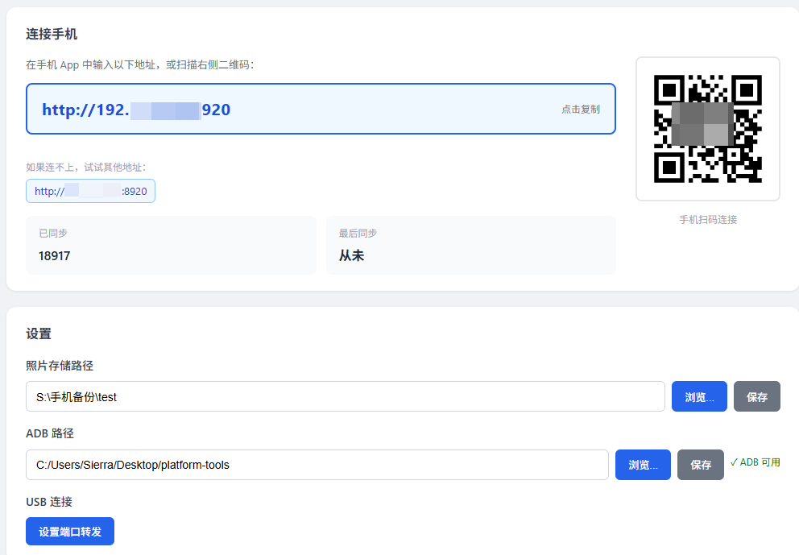

# PhotoSync


一款跨平台的手机相册同步工具。支持通过 **局域网 (Wi-Fi)** 或 **ADB (有线)** 连接，将手机端的照片与视频高速同步至电脑端。大部分工作由AI完成

[](https://github.com/Sierraki/PhotoSync)  [](https://github.com/Sierraki/PhotoSync)  [](https://github.com/Sierraki/PhotoSync/blob/main/LICENSE)  [](https://github.com/Sierraki/PhotoSync/releases)

遇到 BUG 请首先确认软件是否为最新版本。如果确认版本最新且问题依旧存在，请前往 [Issues](https://github.com/Sierraki/PhotoSync/issues) 提交反馈。

---

## 主要特性

* **多模连接**：支持局域网链接与 ADB 高速有线传输。
* **增量同步**：智能识别已同步文件，仅传输新增照片。
* **灵活过滤**：支持按日期、相册名称、文件类型（图片/视频）进行筛选。

---

## 🚀 部署过程

### 1. 环境准备
在开始之前，请确保你的电脑已安装以下软件：
* **Python**: 建议版本 3.8+。
* **ADB (Android Debug Bridge)**: 
    * 本仓库已内置基础版本。
    * 也可以前往 [Android 官网](https://developer.android.com/tools/releases/platform-tools?hl=zh-cn) 下载最新的 **SDK Platform-Tools**。

### 2. 安装步骤

#### 第一步：克隆项目
```bash
git clone [https://github.com/Sierraki/PhotoSync.git](https://github.com/Sierraki/PhotoSync.git)
```
#### 第二步：安装依赖

```bash
cd server
pip install -r requirements.txt
```

#### 第三步：手机端配置

在仓库中找到 .apk 安装包并传输至手机完成安装。
确保手机已开启 USB 调试（仅 ADB 模式需要），并保持 App 处于运行状态。

#### 第四步：启动程序
```bash
python main.py
```
### A 局域网链接
```
设置路径：在浏览器界面中，首先设置好电脑端的照片存储路径。
链接方式：可以把链接复制到手机的输入框上也可以直接扫码链接
连接测试：在手机 App 上点击测试链接。
开始同步：连接成功后，在手机上点击开始同步即可。
```


### B ADB链接(有线)
```
基础设置：设置电脑端的照片存储路径。
配置 ADB：在界面中指定 ADB 路径（选择包含 adb 执行文件的文件夹）。
提示：若路径正确，界面会显示 “ADB 可用”。
准备连接：
点击界面上的设置端口转发按钮。
在手机上打开 USB 调试，并使用数据线连接电脑。
开始同步：在手机 App 点击测试链接，成功后点击开始同步。
```

